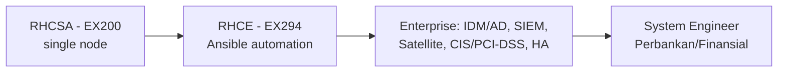

# Modul 21 — System Engineer di Enterprise / Perbankan (Bridge RHCSA → Lapangan)

> Modul ini **bukan** bagian objektif EX200 RHCSA — ia menjembatani apa yang
> sudah Anda kuasai di Modul 0–20 ke **realitas kerja System Engineer di
> lingkungan enterprise skala besar** (mis. perbankan/keuangan seperti Panin).
> Di sini server tidak dikelola satu-satu lewat CLI langsung, melainkan lewat
> *tooling*, *proses*, dan *kepatuhan (compliance)*.

> 📺 Referensi tetap Modul 0–20 (RH124/RH199). Modul ini menambahkan konteks
> enterprise yang tidak diujikan di EX200 tapi **wajib di dunia nyata**.

## 0. Mindset Perbedaan: RHCSA vs Enterprise

| Aspek | RHCSA (ujian) | Enterprise nyata |
|-------|--------------|------------------|
| Sasaran | 1 VM, tugas selesai | Ratusan server, *availability* 99.99% |
| Perubahan | bebas `vim`/`systemctl` | via **Change Request (CR)** + maintenance window |
| User | lokal (`useradd`) | **terpusat** (IDM/AD via SSSD) |
| Patching | `dnf update` langsung | **Satellite/Ansible**, terencana, bisa rollback |
| Log | `journalctl` lokal | **forward ke SIEM** (Splunk/ELK) untuk audit |
| Keamanan | SELinux enforcing | + **CIS/PCI-DSS hardening** + scanning berkala |
| Verifikasi | "perintah jalan" | "terbukti lewat monitoring & ticket tertutup" |

> Prinsip emas enterprise: **setiap change punya rollback plan SEBELUM
> dijalankan**, bukan afterthought.

## 1. Identity & Access Management Terpusat (IDM / AD via SSSD)

Di bank, user **tidak dibuat lokal** (`useradd`) — ia otentikasi ke
**Red Hat Identity Management (IdM)** atau **Active Directory (AD)** lewat
**SSSD**. Ini menjaga *least privilege* & audit trail terpusat.

```bash
# Cek apakah host sudah join ke realm (IdM/AD)
sudo realm list
# Join ke AD (contoh):
sudo realm join --user=admin ad.panin.local
# Konfig otentikasi dikelola SSSD:
sudo systemctl status sssd
# Verifikasi user terpusat bisa login (tanpa user lokal):
id budi@panin.local
getent passwd budi@panin.local
# Pembatasan akses sudo lewat group AD:
sudo visudo   # %domain\ admins@panin.local  ALL=(ALL) ALL
```

**Cara Buktikan:**
```bash
realm list | grep -i configured
id someaduser@domain && echo "SSSD OK"
sudo sssctl domain-status domain.name
```

> ⚠️ Jangan `useradd` untuk user bisnis di production. Pakai direktori
> terpusat. User lokal hanya untuk *break-glass* (akun darurat terkunci).

## 2. Centralized Logging → SIEM (rsyslog / auditd)

EX200 cuma `journalctl`. Di enterprise, log di-forward ke **SIEM** (Splunk,
ELK/Elastic, atau QRadar) untuk **audit kepatuhan (PCI-DSS)** & deteksi anomali.

```bash
# Forward seluruh syslog ke server log terpusat
sudo dnf install -y rsyslog
sudo tee /etc/rsyslog.d/10-forward.conf <<'EOF'
*.*  @@log.panin.local:514          # TCP ke SIEM (@@=TCP, @=UDP)
EOF
sudo systemctl restart rsyslog

# auditd: rekam event security (login gagal, perubahan file kritis)
sudo systemctl enable --now auditd
sudo ausearch -m USER_LOGIN -ts recent   # cari login terakhir
sudo aureport --failed                    # ringkasan kegagalan
```

**Cara Buktikan:**
```bash
logger "TEST-SIEM from $(hostname)"      # kirim log test
sudo tcpdump -n host log.panin.local     # (di server) pastikan trafik masuk
ausearch -m USER_LOGIN | tail
```

## 3. Patching & Lifecycle Terkelola (Satellite / Ansible)

`dnf update` langsung di production = **risiko tinggi**. Enterprise pakai
**Red Hat Satellite** (atau Foreman/Katello) + **Ansible** untuk:
- menyebar patch ke ratusan host dalam *maintenance window*,
- menyimpan *snapshot/content view* agar bisa rollback.

```bash
# Daftar host ke Satellite (dikelola admin Satellite)
subscription-manager status          # cek entitlement
# Atau lewat Ansible (lihat §6) — jangan update manual massal.

# Rollback plan wajib SEBELUM patch:
sudo dnf history list | head         # catat ID terakhir
# setelah patch bermasalah:
sudo dnf history undo <ID>           # kembalikan
```

**Cara Buktikan:**
```bash
subscription-manager status | grep -i "Overall Status: Current"
dnf history list | head -3           # ada rencana undo
```

> Di bank: **tidak ada `dnf update` tanpa CR + approval + rollback plan.**

## 4. Hardening & Compliance (CIS / PCI-DSS / OpenSCAP)

SELinux + firewalld itu *baseline*. Institusi finansial wajib **CIS Benchmark**
& **PCI-DSS** (untuk sistem yang sentuh data kartu). Alat resmi RHEL:
**OpenSCAP**.

```bash
sudo dnf install -y scap-security-guide openscap-scanner
# Scan host terhadap profil CIS / PCI-DSS:
sudo oscap xccdf eval --profile cis \
  --results /tmp/scan.xml \
  --report /tmp/scan.html \
  /usr/share/xml/scap/ssg/content/ssg-rhel10-ds.xml
# Terapkan remediasi otomatis (hati-hati — selalu di lab dulu):
sudo oscap xccdf eval --profile cis --remediate \
  /usr/share/xml/scap/ssg/content/ssg-rhel10-ds.xml
```

**Cara Buktikan:**
```bash
ls -lh /tmp/scan.html                # ada laporan
grep -i "score" /tmp/scan.xml        # lihat nilai kepatuhan
sudo firewall-cmd --list-all         # tetap sesuai segmentasi
getenforce                           # Enforcing
```

## 5. High Availability & Clustering (Pacemaker / PCS)

Sistem perbankan butuh **99.99% uptime**. Satu node mati → layanan pindah
(failover) ke node lain lewat **Pacemaker** + **Corosync** (diurus `pcs`).

```bash
# (Di cluster yang sudah disiapkan admin) cek status:
sudo pcs status
sudo pcs cluster status
# Resource contoh (webapp berbasis systemd):
sudo pcs resource create webapp systemd:webapp op monitor interval=30s
sudo pcs constraint colocation add webapp with virtual-ip
```

**Cara Buktikan:**
```bash
pcs status | grep -i "Online:"
pcs resource show webapp            # running di node mana
```

> Catatan: setup cluster penuh butuh shared storage & fencing — di luar
> cakupan EX200, tapi penting dipahami saat bertugas.

## 6. Automation Skala Besar (Ansible / AAP)

RHCSA = single node. Enterprise = ratusan node → **Ansible** (Red Hat
Ansible Automation Platform / AAP). Ini langkah natural setelah RHCSA
(jalur **RHCE = EX294**).

```bash
# Inventory sederhana
cat > inventory.ini <<'EOF'
[web]
web1.panin.local
web2.panin.local
EOF
# Playbook: pastikan httpd enable & firewalld buka 80
cat > harden.yml <<'EOF'
- hosts: web
  become: true
  tasks:
    - name: ensure httpd running
      ansible.builtin.service: name=httpd state=started enabled=yes
    - name: open port 80
      ansible.posix.firewalld: service=http permanent=true state=enabled immediate=true
EOF
ansible-playbook -i inventory.ini harden.yml
```

**Cara Buktikan:**
```bash
ansible web -i inventory.ini -m ping
ansible web -i inventory.ini -m command -a 'systemctl is-active httpd'
```

## 7. Monitoring Terintegrasi (Zabbix / Prometheus / Nagios)

Server tidak "sehat" kalau tidak dipantau. Linux enterprise diintegrasikan
dengan sistem monitoring (agent melaporkan CPU/RAM/disk/service ke dashboard).

```bash
# Contoh agent Zabbix
sudo dnf install -y zabbix-agent2
sudo sed -i 's/^Server=.*/Server=monitor.panin.local/' /etc/zabbix/zabbix_agent2.conf
sudo systemctl enable --now zabbix-agent2
# Prometheus node_exporter:
./node_exporter &            # metrics di :9100/metrics
```

**Cara Buktikan:**
```bash
systemctl is-active zabbix-agent2
curl -s localhost:9100/metrics | grep node_cpu   # Prometheus
```

## 8. Disaster Recovery & Rollback Plan (wajib sebelum Change)

Setiap perubahan production butuh **rencana pemulihan**. Bukan "semoga lancar".

```bash
# 1. Snapshot VM / LVM sebelum change
sudo lvcreate -s -n root-snap -L 2G /dev/vg0/root
# 2. Backup config kritis
sudo tar czf /backup/etc-$(date +%F).tgz /etc
# 3. Catat DNF history ID (untuk undo)
sudo dnf history list | head -1
# 4. Jika gagal -> restore:
sudo dnf history undo <ID>
sudo lvconvert --merge /dev/vg0/root-snap     # kembalikan LVM
```

**Cara Buktikan:**
```bash
lvs | grep snap                  # snapshot ada
ls -lh /backup/etc-*.tgz         # backup ada
```

## 9. Change Management & SOP (ITIL)

Di perbankan, **tidak ada perintah production tanpa CR (Change Request)**:
1. Buat CR + dokumentasi (what / why / rollback).
2. Dapat **approval** dari change board.
3. Eksekusi di **maintenance window** (jam sepi traffic).
4. Verifikasi via monitoring + tutup ticket.

> Mentalitas: *"Saya bisa menjalankan perintah, tapi apakah saya berhak
> menjalankannya sekarang, dan apa rencana pulihnya?"* — ini pemisah
> junior vs engineer di enterprise.

## 10. Koneksi ke Karier (RHCSA → RHCE → Enterprise)



| Sertifikasi / Skill | Fokus | Kapan relevan |
|---------------------|-------|---------------|
| **RHCSA (EX200)** | administrasi single node RHEL | *fondasi wajib* ✅ sudah di repo |
| **RHCE (EX294)** | otomasi Ansible | naik level ke ratusan node |
| **OpenShift (EX280)** | container platform (beda dari Podman dasar) | bila bank pakai PaaS |
| **Satellite / IDM** | lifecycle & identitas terpusat | operasional harian |
| **ITIL / SOP** | change & incident mgmt | budaya kerja |

## 11. Jebakan Umum di Enterprise

!!! danger "Jebakan"
    - `dnf update` langsung di production → bisa merusak dependensi lintas layanan.
    - `useradd` untuk user bisnis → melanggar audit & *least privilege*.
    - Lupa forward log ke SIEM → insiden tak terdeteksi, gagal compliance.
    - Ganti config tanpa backup & rollback → recovery lambat saat gagal.
    - SSH langsung ke production tanpa *bastion/jump-host* → dilanggar kebijakan.
    - Nonaktifkan SELinux "biar jalan" → temuan audit fatal.

## 12. Self-Check: Siap Hari Pertama?

- [ ] Paham bedanya `useradd` lokal vs SSSD/IDM/AD.
- [ ] Tahu cara forward log ke SIEM & cek `auditd`.
- [ ] Tidak menjalankan `dnf update` tanpa CR + rollback.
- [ ] Kenal OpenSCAP & profil CIS/PCI-DSS.
- [ ] Pernah menjalankan Ansible playbook sederhana.
- [ ] Punya kebiasaan: **backup + snapshot SEBELUM change**.
- [ ] Paham alur Change Request & maintenance window.

> Fondasi RHCSA di repo ini (Modul 0–20) sudah memberi Anda *skill CLI & CLI
> troubleshooting* yang solid. Modul 21 ini melengkapinya dengan **konteks
> organisasi** — kombinasi keduanya yang membuat Anda siap di enterprise.

## Latihan
1. Di lab: pasang `sssd` + `realm` (bisa simulasi dengan IdM/FreeIPA lokal).
2. Forward `rsyslog` ke VM log lain, verifikasi dengan `tcpdump`/`logger`.
3. Jalankan `oscap` scan profil CIS, lihat laporan HTML.
4. Tulis 1 Ansible playbook yang meng-harden 2 node sekaligus (firewalld + service).
5. Buat "Change Plan" fictif: apa yang diubah, kapan, dan **bagaimana rollback-nya**.
