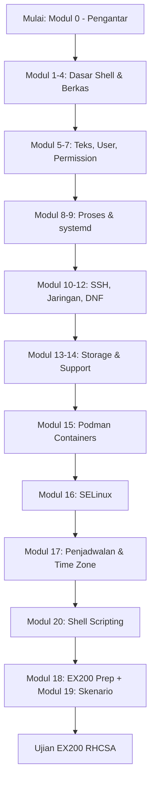

# 🗺️ Pusat Belajar — Panduan RHCSA (RH124 / RH199)

Selamat datang! Halaman ini adalah **peta jalan** agar kamu belajar efektif, tidak
asal loncat. Ikuti urutan, kerjakan LAB di tiap modul, dan uji diri dengan kuis.

> 📌 **EX200 saat ini resmi berbasis RHEL 10 (2026).** Yang diujikan = 11 area
> objektif resmi (essential tools, software + **Flatpak**, shell script, running
> systems, storage GPT/LVM, filesystems, deploy/timer/bootloader/chrony, networking
> IPv4+**IPv6**, users/groups, security/SELinux). **Containers/Podman & Stratis/VDO
> bukan objektif resmi RHEL 10** — ada di repo sebagai materi bonus. Detail di
> [Modul 18 — EX200 Prep](modul/18-ex200-prep.md).

## 🧭 Roadmap Belajar 16 Minggu



| Minggu | Fokus | Modul |
|--------|-------|-------|
| 1–2 | Dasar akses, shell, berkas, bantuan | 0, 1, 2, 3, 4 |
| 3–4 | Teks (vim), user/grup, permission & ACL | 5, 6, 7 |
| 5–6 | Proses, systemd service | 8, 9 |
| 7–8 | SSH hardening, jaringan, DNF | 10, 11, 12 |
| 9–10 | File system, LVM, support/log | 13, 14 |
| 11 | Containers (Podman) | 15 |
| 12–16 | Ulangi LAB + Simulasi EX200 | 18 (EX200 Prep) + 19 (Skenario) + LAB |

## 🎯 Cara Pakai Panduan Ini

1. **Baca modul** secara berurutan (tiap modul punya latihan).
2. **Kerjakan di lab nyata** (VirtualBox/Rocky/WSL2/Podman) — jangan hanya baca.
3. **Cek "Jebakan Umum" & "Koneksi EX200"** di tiap modul — itu yang sering
   membuat peserta gagal ujian.
4. **Jawab kuis** di akhir modul untuk mengukur pemahaman.
5. **Ulangi LAB** sampai semua perintah keluar tanpa melihat catatan.

## 🧪 Siapkan Lab (Gratis)

!!! tip "Rekomendasi"
    Gunakan **Rocky Linux 9** atau **AlmaLinux 9** (klon RHEL, gratis & biner-kompatibel)
    di VirtualBox. Atau WSL2: `wsl --install -d FedoraLinux-42`.

```bash
# Cek versi RHEL-like
cat /etc/redhat-release

# Atau langsung latihan di container (tanpa install OS)
podman run -it --name lab-rhel rockylinux:9 bash
```

## 📚 Struktur Navigasi

- **Modul 0–14**: materi inti RH124.
- **Modul 15**: Podman & Containers (muncul di EX200 RHEL 9).
- **Modul 16**: SELinux (keamanan wajib EX200).
- **Modul 17**: Penjadwalan & Time Zone (cron/at/systemd timer).
- **Modul 18**: Persiapan ujian EX200 + simulasi soal.
- **Modul 19**: Skenario EX200 Terukur (latihan berbobot + kunci).
- **Modul 20**: Shell Scripting Dasar (wajib EX200).
- **LAB**: kumpulan tugas praktik & jawaban.
- **Cheat Sheet**: ringkasan perintah cepat.
- **Persiapan EX200**: taktik & jebakan ujian.

## ✅ Cek Kesiapan Sebelum Ujian

- [ ] Bisa `vim` tanpa melihat cheat sheet
- [ ] `nmcli` set IP statis & verifikasi
- [ ] `systemctl` enable/disable/status + `journalctl`
- [ ] `dnf` install/update/remove + module stream
- [ ] LVM: create → extend → growfs
- [ ] `firewall-cmd` + **SELinux** (`setsebool`, `restorecon`) — tidak mematikan
- [ ] `ssh-keygen` + `ssh-copy-id` + hardening `sshd`
- [ ] Podman: pull/run/generate systemd

> "Orang yang lulus RHCSA bukan yang hafal, tapi yang bisa **memverifikasi**
> pekerjaannya sendiri." — prinsip lab ini.
